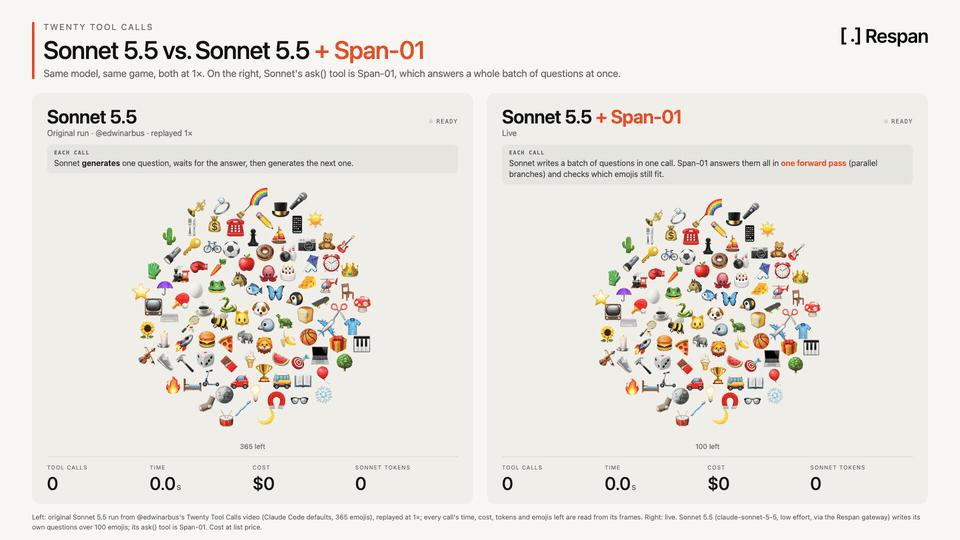

# Span-01 showcases

Small, runnable demos of [Span-01](https://www.respan.ai/docs/documentation/span-01/quickstart), Respan's decision model. Span-01 reads a span and returns present / absent / not-observable for any number of plain-language definitions, all in one forward pass, without generating text.

| # | Showcase | What it shows |
|---|---|---|
| 01 | [Twenty questions](01-twenty-questions) | Sonnet 5.5 writes the questions; Span-01 answers a whole batch of them in one forward pass. |

Each showcase is self-contained: `cd` into its folder and follow its README. Span-01 is in early access; see the [quickstart](https://www.respan.ai/docs/documentation/span-01/quickstart) for access and the API reference.
